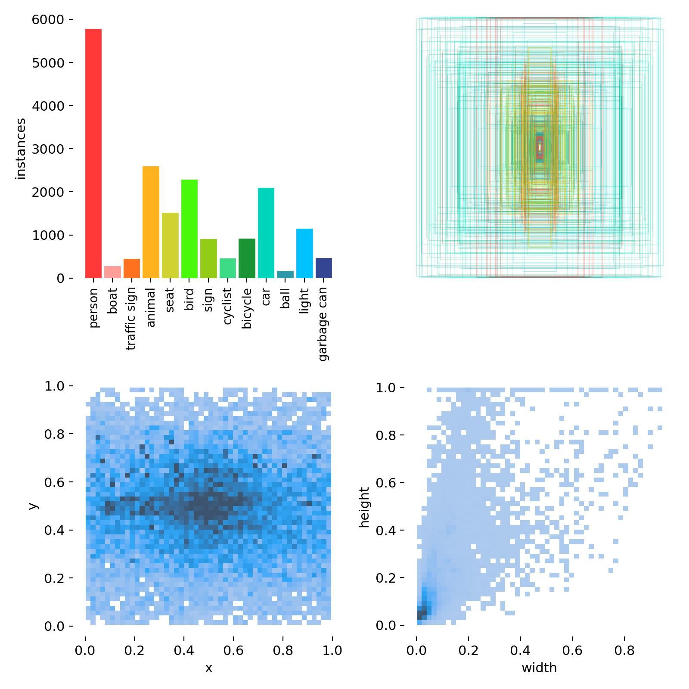
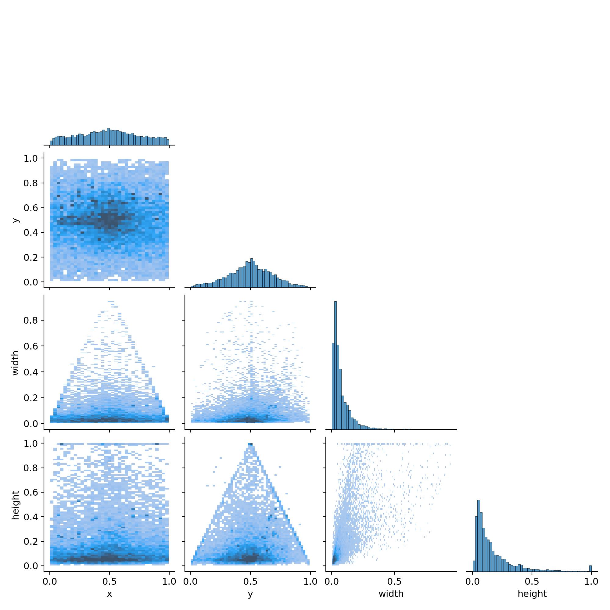
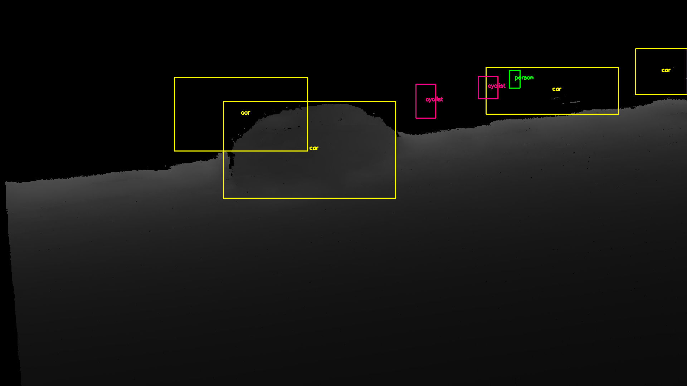
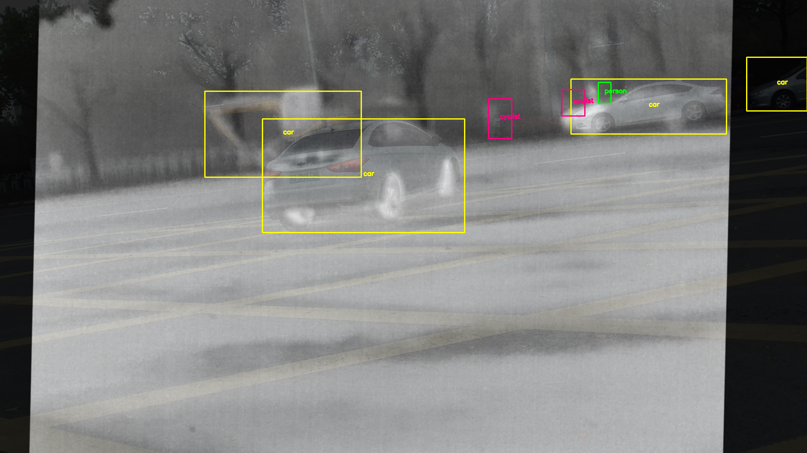
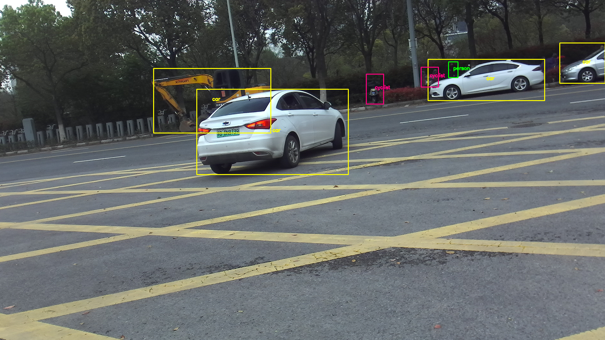
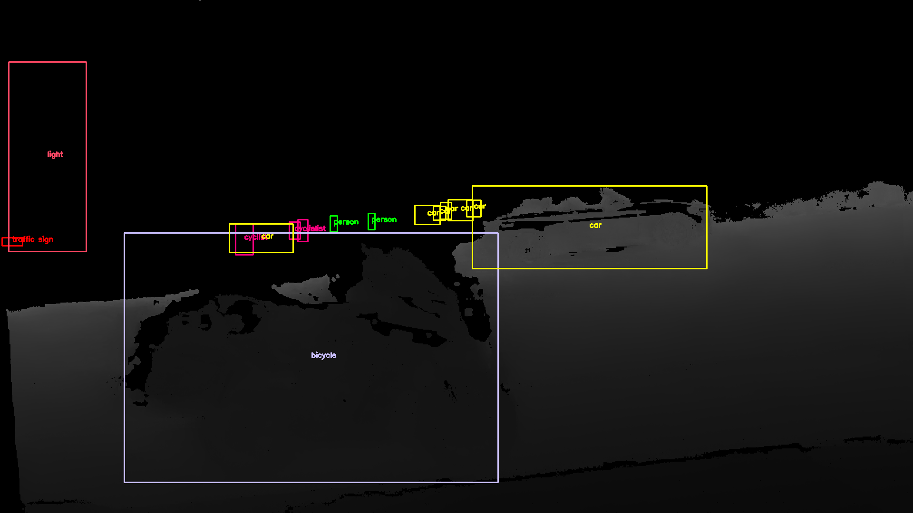
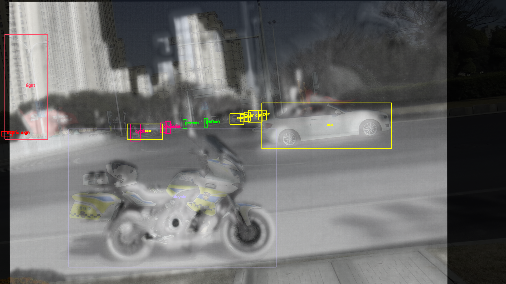
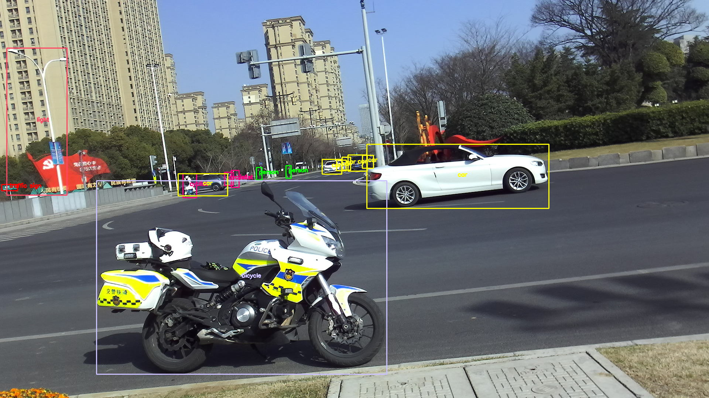

# ICPR Multi-Modal Visual Pattern Recognition Challenge Track 2: Multi-Modal Object Detection

# Overview

<div align=center>
  
</div>

This is the official repository for Track 2: _Multi-Modal Object Detection challenge (ICPR 2024)_.

This challenge focuses on Object Detection utilizing multi-modal data source including RGB, depth, and infrared images. You can visit the [official website](https://prci-lab.github.io/mmpr-workshop-icpr20242) for more details or directly participate in this track on [codalab]().

# Dataset

In this track, we provide a dataset named **ICPR_JNU MDetection-v1**, which comprises 5,000 multi-modal image pairs (4000 for training and 1000 for testing) across 13 classes. Details are as follows in this repo. To participate in this track, please submit your requirements by choosing "_Challenge Track 2: Multi-modal Detection_" in this [Online Form](https://docs.google.com/forms/d/e/1FAIpQLSeJGZTYW-JS0-IJKnWgYGnE0EgdXnoL7Yi0xc-F9Z6XU1X4Zg/viewform) and filling out other options.


## Details

  | Lables | Labels Correlation |
  |:-----------:|:-----------:|
  ||  |

## Examples

| Depth | Thermal-IR | RGB |
|:-----------:|:------------:|:---------:|
|  |  |  |
|  |  |  |

## Structure
```
ICPR_JNU MDetection-v1
├──/images/
│ ├── train
│ │ ├──color
│ │ │ ├── train_0001.png
│ │ │ ├── train_0002.jpg
│ │ │ ├── ... ...
│ │ │ ├── train_4000.jpg
│ │ ├──depth
│ │ │ ├── train_0001.png
│ │ │ ├── train_0002.jpg
│ │ │ ├── ... ...
│ │ │ ├── train_4000.jpg
│ │ ├──infrared
│ │ │ ├── train_0001.png
│ │ │ ├── train_0002.jpg
│ │ │ ├── ... ...
│ │ │ ├── train_4000.jpg
│ ├── val
│ │ ├── ... ...
│ ├── test
│ │ ├──color
│ │ │ ├── test_0001.png
│ │ │ ├── test_0002.jpg
│ │ │ ├── ... ...
│ │ │ ├── test_1000.jpg
│ │ ├──depth
│ │ │ ├── test_0001.png
│ │ │ ├── test_0002.jpg
│ │ │ ├── ... ...
│ │ │ ├── test_1000.jpg
│ │ ├──infrared
│ │ │ ├── test_0001.png
│ │ │ ├── test_0002.jpg
│ │ │ ├── ... ...
│ │ │ ├── test_1000.jpg
└──/labels/
  ├── /train/color/
  │ ├── train_0001.txt
  │ ├── train_0002.txt
  │ │ ├── ... ...
  │ ├── train_4000.txt
  ├── /val/color
  │ ├── ... ...
  ├── /test/color/
  │ ├── test_0001.txt
  │ ├── test_0002.txt
  │ │ ├── ... ...
  │ ├── test_1000.txt
  └───
```

# Baseline

This code is based on [yolo-v5](https://github.com/ultralytics/yolov5/releases), you can follow the [README_yolo.md](/README_yolo.md) or [README_yolo.zh-CN.md](/README_yolo.zh-CN.md) first to build a envirement.  We have modified it to accommodate this multimodal task, while you can also build your own model to accomplish this task.

In this code, we provide a [/data/ICPR_JNU_MMDetection_v1.yaml](/data/ICPR_JNU_MMDetection_v1.yaml) to suit this dataset. You should prepare the dataset and change the path to your own in this file.

- **❗Note!!!** The valadation set is not provided, you should divide the train set appropriately by yourself to validate during training.

## Training 
- To build your own model, you should redesign the modules in [./models/yolo.py](/models/yolo.py) at least.
- To train your own model, you should modify the **Hyperparameters** in [./data/hyps](data/hyps) first.
- Train your own model directly using:
  ```bash
    python train.py
  ```
## Testing

Generate the predictions `pred.zip` for test set:

  ```bash
  python test_model.py
  ```

- **❗Note** that labels in testset are all blank, only on purpose of generating your predictions conveniently. Results `pred.zip` will be generated automatically and it's the only file you need to submit to _Codalab_ for evaluation. More details of evaluation can be found [here]().


*If you have any questions, please email us at yangxiao2326@gmail.com.*
